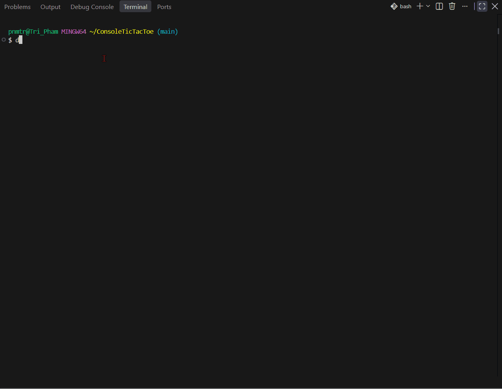

# Console Tic-Tac-Toe

A two-player Tic-Tac-Toe game written in C# and played in the console.   
A project for the Algorithms and Datastructures course at Centria AMK, academic year 2026-2027.



## Features

- Two-player X/O gameplay
- Input validation for non-numeric and out-of-range input
- Occupied-position validation
- Win detection for rows, columns, and diagonals
- Draw detection

## How to Play

Players take turns entering a number from 1 to 9 corresponding to a position on the board.

```text
1 | 2 | 3
---------
4 | 5 | 6
---------
7 | 8 | 9
```

Player X starts first. The first player to place three marks in a row, column, or diagonal wins.

## Run

This project targets .NET 8.0.

From the project directory, run:

```bash
dotnet run
```

## What I Practiced

- C# methods and arrays
- Loops and conditional statements
- Console input and output
- Input validation with `int.TryParse`
- Array indexing
- Win and draw detection
- Breaking a problem into small methods

## Testing

The program was manually tested for:

- Winning games
- Draw games
- Non-numeric input
- Numbers outside the 1-9 range
- Attempts to select an occupied position
